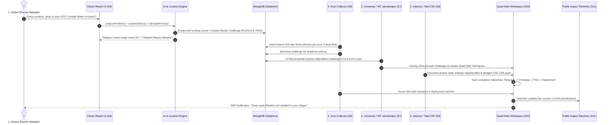

# SamadhanSetu (समाधानसेतु) — Master PRD & Viva Defense Dossier
> **Tagline:** *People. Ideas. Impact. — Together for a Better Tomorrow*  
> **SIH Problem Statement ID:** 26043 | **Theme:** Agriculture, FoodTech & Rural Development | **Category:** Software  
> **Nodal Body:** Government of Jharkhand | **Status:** Production-Ready for SIH 2026 Evaluation  

---

## 1. Quick-Glance Project Sheet (SIH Pitch Card)

| Attribute | Details |
| :--- | :--- |
| **Problem Statement** | Digital platform to crowdsource societal challenges & facilitate collaborative problem solving |
| **Primary Mission** | Transform fragmented grassroots pain-points into university-engineered, industry-sponsored, and government-deployed solutions |
| **The 4 Stakeholders** | **1. People (Citizens)** · **2. Universities (Solvers)** · **3. Industry (CSR Sponsors)** · **4. Government (Enablers)** |
| **6-Stage Lifecycle** | $\text{Report} \rightarrow \text{AI Triage} \rightarrow \text{University Prototype} \rightarrow \text{Industry Sponsorship} \rightarrow \text{Govt Sanction} \rightarrow \text{Field Impact}$ |
| **Tech Stack** | **Frontend:** React 18 + Vite, Tailwind CSS / Vanilla CSS, Lucide Icons, Interactive GIS Map<br>**Backend:** Node.js, Express.js (ES Modules), REST APIs, JWT Auth<br>**Database:** MongoDB 7.0+ (Mongoose) with native `2dsphere` GeoJSON geospatial indexing |
| **Core AI Services** | Multilingual Domain Classification, Cluster Deduplication, Priority Scoring ($0\text{--}10$), Quad-Helix Matchmaking |

---

## 2. Core Innovation: Why SamadhanSetu vs. Grievance Portals (CPGRAMS / JharSewa)

| Dimension | Traditional Portals (CPGRAMS / JharSewa) | SamadhanSetu (समाधानसेतु) |
| :--- | :--- | :--- |
| **Core Philosophy** | Treats issues as **complaints** to be closed administratively | Treats issues as **innovation challenges** to be engineered |
| **Handling Duplicates** | Disconnected duplicate tickets clog the system | **AI Semantic & Spatial Deduplication** merges tickets into 1 Master Challenge |
| **Who Solves It?** | Overburdened local government contractors only | **Quad-Helix Ecosystem:** Engineering students, AgTech researchers, and CSR mentors |
| **Incentives** | Zero incentive for public or academia | **NEP 2020 Academic Credits** (4–6 credits) for students + **CSR ESG fulfillment** |
| **Transparency** | Closed-door ticket status ("Under Process") | **Real-time 4-Phase Sandbox Tracker** (Research $\rightarrow$ Prototype $\rightarrow$ Pilot $\rightarrow$ Deployment) |
| **Spatial Intelligence** | Basic text dropdowns | **MongoDB `2dsphere` Geospatial Heatmap** with district alert levels (*Normal / Active / Critical*) |

---

## 3. Quad-Helix Stakeholder Matrix

```
                      [ 2. UNIVERSITY (Solvers) ]
                       NIT Jamshedpur / BAU / BIT Mesra
                       - Builds Prototypes (4-6 NEP Credits)
                                /       \
                               /         \
   [ 1. PEOPLE (Citizens) ]   /    [AI]   \   [ 3. INDUSTRY (Sponsors) ]
    Pragya Kendras & Farmers <   ENGINE   >   Tata Projects / Tata Steel CSR
    - Reports with GPS & Photo \         /    - Pledges Grants & Tech Mentorship
                                \       /
                                 \     /
                      [ 4. GOVERNMENT (Enablers) ]
                       District Collectors / DWSD Jharkhand
                       - GIS War Room, Sanctions & Pilot Permits
```

| Stakeholder | Ingestion Method | Core Action / Output | Value / Incentive Received |
| :--- | :--- | :--- | :--- |
| **1. Citizen (People)** | Multimodal Report (Voice, Photo, GPS, Web/Mobile, Pragya Kendra) | Voices local challenges (water, crops, roads, health) | Direct issue resolution, SMS alerts, public impact telemetry |
| **2. University** | AI Recommended Feed (`/university`) | Faculty + students claim challenges, build prototypes | **NEP 2020 Capstone Credits**, IPR/Patent potential, research funding |
| **3. Industry** | Sponsorship Marketplace (`/industry`) | Pledges micro-grants (₹5L–₹25L), hardware & mentorship | **Mandatory CSR Compliance**, ESG impact metrics, early talent hiring |
| **4. Government** | District GIS War Room (`/government`) | Analyzes spatial clusters, sanctions projects, issues pilot permits | Data-driven governance, verified grassroots grievance redressal |

---

## 4. End-to-End System Workflow (The 6 Stages)



---

## 5. Complete Sequential Function Execution Guide

Here is every single function used in the project, listed in the exact chronological order of system execution:

```
[Phase 1: Auth]         ->  POST /api/auth/register, POST /api/auth/login
                                 │
[Phase 2: Location]     ->  formatGeoPoint() -> calculateDistanceKm() -> resolveDistrict()
                                 │
[Phase 3: AI Triage]    ->  classifyDomain() -> calculatePriority() -> analyzeProblem() -> findSimilarChallenges()
                                 │
[Phase 4: Ingestion]    ->  POST /api/challenges/report (Saves ChallengeReport & updates Master Challenge)
                                 │
[Phase 5: Govt GIS]     ->  aggregateDistrictHotspots() -> GET /api/challenges/geo/hotspots
                                 │
[Phase 6: Matchmaking]  ->  findUniversityMatches() & findIndustryPartners()
                                 │
[Phase 7: Workspace]    ->  POST /api/challenges/:id/accept -> PATCH /api/workspaces/:id/tasks/:taskId
                                 │
[Phase 8: Telemetry]    ->  GET /api/stats/summary (Feeds Landing & Impact page live counters)
```

---

### Phase 1: Authentication & User Registration
1. **`POST /api/auth/register`** (`backend/routes/auth.js`)
   * **Input:** `{ fullName, email, mobile, password, role, state }`
   * **Execution:** Validates payload, verifies role is one of `[Citizen, University, Industry, Government]`, and saves to MongoDB `User` collection.
   * **Output:** HTTP 201 with created user profile.

2. **`POST /api/auth/login`** (`backend/routes/auth.js`)
   * **Input:** `{ email, password, role }`
   * **Execution:** Checks credentials, matches role, and issues session payload.
   * **Output:** User object + JWT token used by frontend to redirect to the correct dashboard.

---

### Phase 2: Location & Spatial Engine (`backend/services/location_service.js`)
3. **`formatGeoPoint(longitude, latitude)`**
   * **Input:** `(longitude: number, latitude: number)`
   * **Execution:** Formats coordinates into standard MongoDB GeoJSON Point format.
   * **Output:** `{ type: "Point", coordinates: [lng, lat] }`

4. **`calculateDistanceKm(coordA, coordB)`**
   * **Input:** `([lng1, lat1], [lng2, lat2])`
   * **Execution:** Computes great-circle distance between two geographic coordinates using the **Haversine formula** with Earth radius $R = 6371\text{ km}$.
   * **Output:** Distance in kilometers (number, e.g. `14.28`).

5. **`resolveDistrict(coordinates, locationName)`**
   * **Input:** `(coordinates: [lng, lat], locationName: string)`
   * **Execution:**
     1. Searches `locationName` string for mentions of any of Jharkhand's 10 core district hubs (*Ranchi, Bokaro, Dhanbad, Khunti, Hazaribagh, East Singhbhum, Deoghar, Dumka, Palamu, Giridih*).
     2. If text search fails, uses `calculateDistanceKm()` against all district center coordinates to pick the nearest district headquarters.
   * **Output:** `{ district: "Ranchi", state: "Jharkhand", coordinates: [85.3240, 23.3441] }`

---

### Phase 3: AI Problem Analysis & Priority Engine (`backend/services/ai_service.js`)
6. **`classifyDomain(text)`**
   * **Input:** `(text: string)` (Citizen's problem description)
   * **Execution:** Scans text for domain-specific keywords and assigns matching engineering expertise:
     * *Agriculture:* `crop`, `farm`, `canal`, `soil`, `seed`, `irrigation`, `grain`
     * *Healthcare:* `health`, `doctor`, `medicine`, `clinic`, `vaccine`, `hospital`
     * *Infrastructure:* `road`, `bridge`, `school`, `building`, `culvert`, `power`
     * *Water & Sanitation (Default):* `water`, `arsenic`, `borewell`, `handpump`
   * **Output:** `{ domain: "Water & Sanitation", suggestedExpertise: "Environmental Engineering, Water Filtration, IoT TDS Quality Monitoring" }`

7. **`calculatePriority(severity, reportCount)`**
   * **Input:** `(severity: "High"|"Medium"|"Low", reportCount: number)`
   * **Execution:** Computes score via: $\text{BaseScore} + \min(2.0, (\text{reportCount}-1) \times 0.2)$.
     * Base scores: High = 8.0, Medium = 6.0, Low = 4.0.
     * Score $\ge 7.5 \rightarrow$ High, $5.5\text{--}7.4 \rightarrow$ Medium, $< 5.5 \rightarrow$ Low.
   * **Output:** `{ priority: "High", priorityScore: 8.6 }`

8. **`analyzeProblem(problemText, severity)`**
   * **Input:** `(problemText: string, severity: string)`
   * **Execution:** Master wrapper calling `classifyDomain()` and `calculatePriority()` in a single step.
   * **Output:** Full initial AI diagnostic object with timestamp.

9. **`findSimilarChallenges(domain, coordinates, existingChallenges)`**
   * **Input:** `(domain: string, coordinates: [lng, lat], existingChallenges: Array)`
   * **Execution:** Checks for open non-deployed challenges in the same domain within the target region to prevent duplicate ticket fragmentation.
   * **Output:** Matching `Challenge` object if found (for merging), or `null` (for new creation).

---

### Phase 4: Ingestion & Deduplication Route (`backend/routes/challenges.js`)
10. **`POST /api/challenges/report`**
    * **Input:** Multipart form data `{ description, severity, latitude, longitude, locationName }`
    * **Execution:**
      1. Calls `resolveDistrict()` and `formatGeoPoint()`.
      2. Calls `analyzeProblem()`.
      3. Saves a `ChallengeReport` entry to MongoDB.
      4. Calls `findSimilarChallenges()`. If existing cluster found: increments `reportCount`, updates `priorityScore`, and attaches report ID. Else: creates new `Challenge` record.
    * **Output:** HTTP 201 returning AI diagnostic payload rendered on Screen 5 (AI Result Page).

---

### Phase 5: GIS War Room Hotspot Aggregation (`backend/services/location_service.js`)
11. **`aggregateDistrictHotspots(challenges)`**
    * **Input:** `(challenges: Array)` (All open challenges from database)
    * **Execution:** Aggregates challenge counts, report volumes, and high-priority incidents for all 10 Jharkhand districts. Computes alert status:
      * **Critical:** $\ge 2$ High Priority issues OR $\ge 20$ Reports.
      * **Active:** $\ge 1$ Open Challenge.
      * **Normal:** 0 Issues.
    * **Output:** Array of district hotspot summaries.

12. **`GET /api/challenges/geo/hotspots`** (`backend/routes/challenges.js`)
    * **Execution:** Calls `aggregateDistrictHotspots()` on all database challenges.
    * **Output:** GeoJSON response powering the interactive color-coded map pins in the Government Dashboard.

---

### Phase 6: Quad-Helix Matchmaking (`backend/services/matching_service.js`)
13. **`findUniversityMatches(challenge)`**
    * **Input:** `(challenge: Object)`
    * **Execution:** Matches challenge domain to institutional catalog:
      * *Water/Infra* $\rightarrow$ **NIT Jamshedpur** (Civil & Env Dept)
      * *Agriculture* $\rightarrow$ **Birsa Agricultural University (BAU Ranchi)**
      * *Healthcare* $\rightarrow$ **BIT Mesra Ranchi** (Bio-Engineering Dept)
    * **Output:** `{ institutionName, department, academicCredits: 4, leadFaculty, matchConfidencePercent: 94 }`
    * **API Route:** `GET /api/challenges/recommendations/university`

14. **`findIndustryPartners(challenge)`**
    * **Input:** `(challenge: Object)`
    * **Execution:** Matches challenge domain to CSR partner corporate catalog:
      * *Water* $\rightarrow$ **Tata Projects** (₹15L grant)
      * *Agriculture* $\rightarrow$ **Tata Steel Foundation** (₹20L grant)
      * *Healthcare* $\rightarrow$ **Jindal Steel & Power** (₹12L grant)
      * *Infrastructure* $\rightarrow$ **Adani Foundation** (₹25L grant)
    * **Output:** `{ partnerName, csrDomain, availableGrant, mentorshipOffered: true }`
    * **API Route:** `GET /api/challenges/opportunities/industry`

---

### Phase 7: Project Workspace & Milestone Progression (`backend/routes/workspaces.js`)
15. **`POST /api/challenges/:id/accept`** (`backend/routes/challenges.js`)
    * **Execution:** Triggered when university clicks `[Accept Challenge]`. Advances challenge status to `In Progress` and creates a new collaborative `Workspace` with initial tasks and team roster.
    * **Output:** HTTP 201 with newly created Workspace ID.

16. **`GET /api/workspaces/:id`** (`backend/routes/workspaces.js`)
    * **Output:** Full workspace document (Current Phase: `RESEARCH` $\rightarrow$ `PROTOTYPE` $\rightarrow$ `PILOT` $\rightarrow$ `DEPLOYMENT`, Team Cards, Checklist, Hardware BOM).

17. **`PATCH /api/workspaces/:id/tasks/:taskId`** (`backend/routes/workspaces.js`)
    * **Input:** `taskId`
    * **Execution:** Toggles task status to `COMPLETED`, recalculates `progressPercentage`, and automatically promotes `currentPhase` when milestones are reached.
    * **Output:** Updated workspace state.

---

### Phase 8: Platform Telemetry & Global Stats (`backend/routes/stats.js`)
18. **`GET /api/stats/summary`**
    * **Execution:** Aggregates counts of all `ChallengeReport` entries, `Challenge` clusters, active `Workspace` projects, deployed solutions, and calculated beneficiaries.
    * **Output:** `{ reportsReceived, challengesIdentified, projectsInProgress, solutionsDeployed, peopleBenefited }` (Feeds Live Impact Counters on Home & Impact screens).

---

## 6. Quick Reference: Function-to-File Matrix

| Order | Function Name | File Location | Responsibility |
| :---: | :--- | :--- | :--- |
| **1** | `POST /api/auth/register` | `backend/routes/auth.js` | Registers user under one of 4 RBAC roles |
| **2** | `POST /api/auth/login` | `backend/routes/auth.js` | Authenticates user & issues session |
| **3** | `formatGeoPoint()` | `backend/services/location_service.js` | Converts lat/lng into GeoJSON `Point` |
| **4** | `calculateDistanceKm()` | `backend/services/location_service.js` | Haversine distance formula between GPS points |
| **5** | `resolveDistrict()` | `backend/services/location_service.js` | Maps GPS point to nearest Jharkhand district |
| **6** | `classifyDomain()` | `backend/services/ai_service.js` | NLP keyword classification into 4 domains |
| **7** | `calculatePriority()` | `backend/services/ai_service.js` | Dynamic priority formula ($0\text{--}10$) |
| **8** | `analyzeProblem()` | `backend/services/ai_service.js` | Complete problem analysis wrapper |
| **9** | `findSimilarChallenges()` | `backend/services/ai_service.js` | Deduplication check to merge reports |
| **10**| `POST /api/challenges/report` | `backend/routes/challenges.js` | Ingests report, runs AI/Geo, saves to MongoDB |
| **11**| `aggregateDistrictHotspots()`| `backend/services/location_service.js` | Computes district severity levels for map |
| **12**| `GET /api/challenges/geo/hotspots` | `backend/routes/challenges.js` | Delivers GeoJSON district alert pins |
| **13**| `findUniversityMatches()` | `backend/services/matching_service.js` | Matches domain to universities for NEP credits |
| **14**| `findIndustryPartners()` | `backend/services/matching_service.js` | Matches domain to CSR corporate sponsors |
| **15**| `POST /api/challenges/:id/accept` | `backend/routes/challenges.js` | University claims issue $\rightarrow$ creates Workspace |
| **16**| `GET /api/workspaces/:id` | `backend/routes/workspaces.js` | Returns team roster, tasks, BOM, phase |
| **17**| `PATCH /api/workspaces/:id/tasks/:taskId` | `backend/routes/workspaces.js` | Checks off task & advances project phase |
| **18**| `GET /api/stats/summary` | `backend/routes/stats.js` | Aggregates global telemetry counters |

---

## 7. Database Architecture & MongoDB Schemas

```
+--------------------+        +---------------------+        +--------------------+
|       USERS        | 1    N |  CHALLENGE_REPORTS  | N    1 |     CHALLENGES     |
| - role (4 RBAC)    |--------| - citizen_id (FK)   |--------| - domain, priority |
| - email, mobile    |        | - location (Point)  |        | - location (Point) |
+--------------------+        | - problem_text      |        | - report_count     |
          |                   +---------------------+        +--------------------+
          | 1                                                          | 1
          | N                                                          | 1
+---------------------------------------------------------------------------------+
|                                   WORKSPACES                                    |
| - challenge_id (FK)                                                             |
| - current_phase: [ RESEARCH -> PROTOTYPE -> PILOT -> DEPLOYMENT ]               |
| - team: { university, industry, government, community }                         |
| - tasks: [{ title, status: COMPLETED|IN_PROGRESS|PENDING, due_date }]           |
| - hardware_bom: [{ component, quantity, cost_inr }]                             |
+---------------------------------------------------------------------------------+
```

### Essential Indexes
```javascript
// Native 2dsphere Geospatial Indexes (Fast radius & spatial queries)
db.challenges.createIndex({ "location": "2dsphere" });
db.challenge_reports.createIndex({ "location": "2dsphere" });

// Filtering & Search Indexes
db.challenges.createIndex({ "domain": 1, "district": 1, "priority": 1, "status": 1 });
db.challenges.createIndex({ "priority_score": -1, "createdAt": -1 });
db.users.createIndex({ "email": 1 }, { unique: true });
db.workspaces.createIndex({ "challengeId": 1 });
```

---

## 8. The 12-Screen Navigation & UI Architecture

| # | Screen Name | Route | Target User | Key UI Components & Actions |
| :---: | :--- | :--- | :--- | :--- |
| **S1** | **Landing Page** | `/` | Public | Hero with Civic Tagline, Live Impact Bar (12K+ Reports, 1.8M Beneficiaries), 6-Stage Visual Stepper, CTAs |
| **S2** | **Sign Up** | `/signup` | All 4 Roles | 4-Role Selector Tabs, Name, Email, Mobile, Password, State Dropdown (Default: Jharkhand) |
| **S3** | **Login** | `/login` | All 4 Roles | Role Selector, Email/Mobile + Password, Quick Demo Role Auto-Login buttons |
| **S4** | **Report Problem** | `/report` | Citizens / VLEs | 4-Step Wizard, Problem Textarea, Photo Upload, Auto-GPS Fetch button, Severity Radio (`Low/Med/High`) |
| **S5** | **AI Analysis Result**| `/ai-result`| Citizens | Instant Triage Card: Domain, Identified Issue, Priority Badge, Grouping Metric ("X related reports found") |
| **S6** | **Challenges Explorer**| `/challenges`| All | Multi-filter Toolbar (Domain, State, Priority, Status), Search bar, Sort dropdown, Challenge Feed Cards |
| **S7** | **University Dashboard**| `/university`| Students / Faculty | AI Match Cards with Match Confidence % & NEP Academic Credits tag, `[Accept Challenge]`, Ongoing Projects |
| **S8** | **Industry Dashboard**| `/industry` | CSR / AgTech | Sponsorship Pipeline, Support Types (`Funding/Tech/Mentoring`), `[Support Project]` (Pledge Grant) |
| **S9** | **Government War Room**| `/government`| District Collectors | Interactive Jharkhand District GIS Map (Color-coded pins), Hotspot Analytics, `[Sanction Challenge]` |
| **S10**| **Project Workspace** | `/workspace/:id`| Quad-Helix Team | 4-Phase Stepper, Quad-Helix Member Badges, Interactive Task Checklist, Hardware BOM, `[Update Progress]` |
| **S11**| **Impact Page** | `/impact` | Public / Press | Aggregated Telemetry, Verified Success Stories with Beneficiary count and Before/After Metrics |
| **S12**| **About SamadhanSetu**| `/about` | Public / Jury | Brand Semiotics, Mission Statement, 6 Core Value Pillars, Nodal Governance metadata |

---

## 9. NEP 2020 & CSR Innovation Model

### 9.1 Academic Integration (NEP 2020 Experiential Learning)
* Under **National Education Policy (NEP) 2020**, students require mandatory experiential learning / internship credits.
* SamadhanSetu maps claimed challenges directly to **B.Tech Capstone Projects** or **Rural Innovation Internships**, awarding **4 to 6 university credits** validated by faculty leads.

### 9.2 Corporate CSR Compliance (Companies Act 2013, Section 135)
* Companies with $\ge \text{₹500 Cr}$ net worth or $\ge \text{₹5 Cr}$ net profit must spend 2% of profits on CSR.
* SamadhanSetu qualifies under **Schedule VII (Item ii & iv: Rural development & water sanitation)**, offering audited milestone tracking and verifiable telemetry.

---

## 10. Ultimate Viva & Hackathon Judge Defense Q&A (Top 20 Questions)

#### Q1: What is the core problem and why is your platform unique?
> **Answer:** Fragmented grassroots societal issues currently die in bureaucratic grievance portals (like CPGRAMS) as isolated complaints. **SamadhanSetu** is the first Quad-Helix platform that converts complaints into engineering challenges solved by universities (for NEP credits), funded by industry (via CSR), and enabled by government.

#### Q2: How does your AI deduplicate citizen reports?
> **Answer:** When a citizen reports an issue, our AI runs domain classification and computes spatial proximity via Haversine distance. If a matching issue exists within the district in the same domain, it merges the report into a single **Master Challenge**, incrementing the report count and elevating the priority score dynamically.

#### Q3: How does the priority scoring algorithm work?
> **Answer:** The formula is: $\text{Priority Score} = \min(10.0, \text{BaseScore} + \min(2.0, (N - 1) \times 0.2))$, where Base Score is 8.0 for High, 6.0 for Medium, 4.0 for Low severity. Every additional citizen report adds $+0.2$ urgency points, ensuring high-density community crises automatically surface to the top of the Government War Room.

#### Q4: Why MongoDB instead of PostgreSQL / PostGIS?
> **Answer:** 
> 1. **Polymorphic Data:** An agricultural problem requires soil parameters; a water problem requires IoT TDS telemetry. MongoDB's flexible BSON handles multimodal schemas without messy SQL migrations.
> 2. **Native Geospatial:** MongoDB provides first-class `2dsphere` GeoJSON indexing and `$nearSphere` operators out of the box with zero external extensions.
> 3. **Embedded Workspaces:** Teams, milestone checklists, and hardware BOM are stored as embedded subdocuments, eliminating multi-table joins.

#### Q5: What if a rural citizen doesn't have a smartphone or internet?
> **Answer:** SamadhanSetu integrates with **Jharkhand Pragya Kendras (Common Service Centres - CSCs)** and Village Level Entrepreneurs (VLEs), allowing assisted digital submission. It also supports voice notes and offline browser caching.

#### Q6: How do you incentivize university students and professors?
> **Answer:** Students earn **4 to 6 NEP 2020 academic credits** for Capstone/Internship requirements. Faculty members gain applied research publications, government consultancy credits, and prototype grant funding.

#### Q7: Why would corporate companies invest their CSR funds here?
> **Answer:** Under Section 135 of the Indian Companies Act, corporations must fulfill rural development CSR quotas. SamadhanSetu provides pre-verified projects with transparent milestone escrow tracking and measurable ESG telemetry (e.g., liters of clean water provided).

#### Q8: How is the government involved in the workflow?
> **Answer:** District Collectors and department heads use the **Government GIS War Room (Screen 9)** to monitor district alert statuses (*Normal / Active / Critical*), sanction Master Challenges, and grant field trial permissions.

#### Q9: What prevents fake or malicious problem submissions?
> **Answer:** Reports undergo a 3-layer validation: (1) Device GPS coordinates are matched against the reported location; (2) Multi-report clustering filters out one-off spam; (3) University teams and local Panchayats conduct on-ground baseline surveys before prototyping begins.

#### Q10: What are the 4 user roles in RBAC?
> **Answer:** 
> * `Citizen`: Can report problems and view public challenges/impact.
> * `University`: Can accept challenges, create teams, and manage workspaces.
> * `Industry`: Can browse sponsorship pipelines and pledge CSR grants.
> * `Government`: Can view statewide GIS maps, sanction projects, and clear permits.

#### Q11: How does the Project Workspace track progress?
> **Answer:** It uses a 4-phase sequential pipeline: **1. Research $\rightarrow$ 2. Prototype $\rightarrow$ 3. Pilot $\rightarrow$ 4. Deployment**. Completing interactive checklist tasks dynamically advances the project completion percentage.

#### Q12: Which districts in Jharkhand are actively supported in your GIS engine?
> **Answer:** 10 core district hubs: Ranchi, Bokaro, Dhanbad, Khunti, Hazaribagh, East Singhbhum (Jamshedpur), Deoghar, Dumka, Palamu, and Giridih, with fallback to state-level coordinates.

#### Q13: What happens when a solution is successfully deployed?
> **Answer:** The project status turns to `Deployed`, IoT sensor telemetry or field verification confirms success, an SMS is triggered to all citizens who reported the issue, and the impact metrics are pushed to the live public Impact Page (Screen 11).

#### Q14: How does your system ensure low operational cost?
> **Answer:** The entire platform uses a lightweight Node.js/Express backend with deterministic keyword NLP heuristics and native MongoDB indexing. It requires zero expensive third-party paid AI API tokens for core triage.

#### Q15: How does the UI accommodate accessibility?
> **Answer:** Built with high-contrast civic tokens (Deep Navy `#0F2C59`, Emerald Green `#16A34A`, Crimson Red `#DC2626`), clean typography (`Inter`), visual priority pills, and segmented role controls.

#### Q16: Can this platform be scaled outside Jharkhand?
> **Answer:** Yes. The geospatial and district resolution architecture is modular. Changing the state coordinate catalog allows instant nationwide deployment across all 28 states and 8 Union Territories.

#### Q17: How is data privacy handled?
> **Answer:** Passwords are securely hashed, citizen personal phone numbers and identities are masked on public feeds, and only anonymized problem descriptions and geolocations are visible in the Explorer.

#### Q18: What is the Hardware BOM inside the Workspace?
> **Answer:** It is a structured Bill of Materials (components, quantities, estimated INR costs) submitted by the engineering team so that Industry CSR sponsors know exactly how their grant is being utilized.

#### Q19: What are the 4 core problem domains?
> **Answer:** **1. Water & Sanitation**, **2. Agriculture & FoodTech**, **3. Healthcare & Cold-Chain**, **4. Rural Infrastructure**.

#### Q20: What is your 10-second elevator pitch?
> **Answer:** *"SamadhanSetu is India's first Quad-Helix innovation platform that crowdsources rural pain-points, groups them with AI, and connects Citizens, Engineering Universities, CSR Sponsors, and District Collectors to deploy real solutions."*

---

## 11. 3-Minute Live SIH Demonstration Walkthrough

```
[0:00 - 0:30] Screen 1 (Home Page)
- Show Grand Vision: "Turn Societal Problems Into Real Solutions".
- Highlight live stats: 12,482 Reports | 1.8M Beneficiaries | 6-Stage Journey.

[0:30 - 1:00] Screen 4 & 5 (Citizen Report & Instant AI Triage)
- Click [Report a Problem] -> Select "High Severity" -> Click [Use My Location] -> Submit.
- Audience sees Screen 5: AI instantly categorizes it as "Water & Sanitation" and merges 7 related reports into a single Master Challenge.

[1:00 - 1:30] Screen 9 (Government GIS War Room)
- Switch to District Collector view. Show interactive Jharkhand Map.
- Ranchi / Khunti glows RED (Critical Alert). Collector sanctions the challenge.

[1:30 - 2:00] Screen 7 & 8 (University & Industry Collaboration)
- NIT Jamshedpur logs in -> Sees "Water Quality Monitoring" with High AI Match (4 NEP Credits) -> Clicks [Accept Challenge].
- Tata Projects logs in -> Discovers project under Industry Opportunities -> Clicks [Support Project] and pledges ₹15L CSR grant.

[2:00 - 2:40] Screen 10 (Collaborative Project Workspace)
- Open "Clean Water Project — Village X".
- Demonstrate Quad-Helix team roster, check off "Water testing" milestone task, and advance prototype phase to 60%.

[2:40 - 3:00] Screen 11 & 12 (Public Impact & Closing)
- Navigate to Impact Page -> Show telemetry counter update (+3,500 villagers with clean water) -> Conclude with motto: "People. Ideas. Impact."
```
